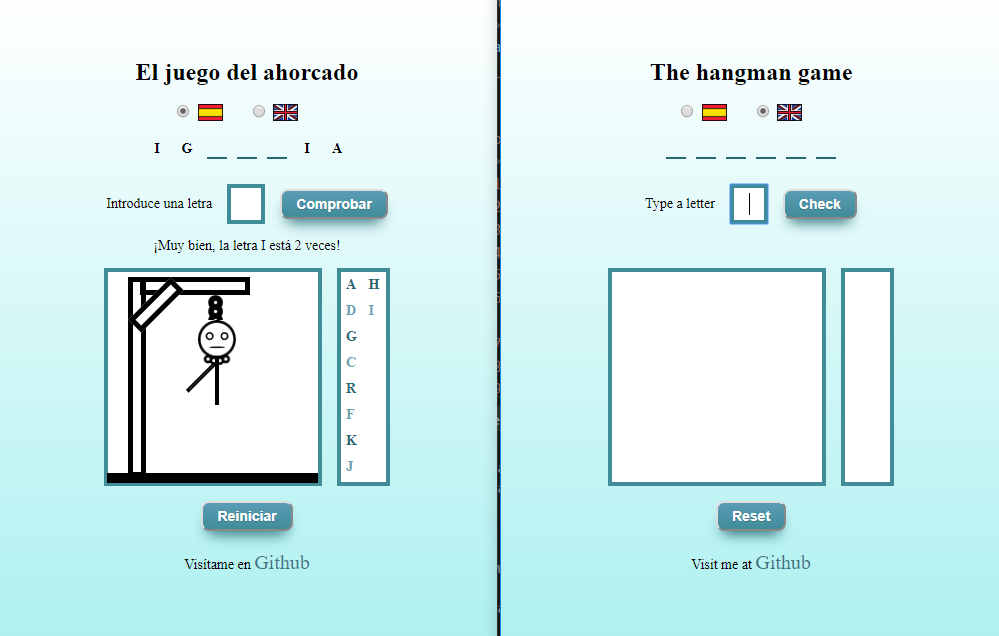
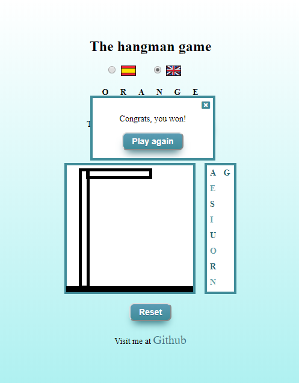

# Hangman game by SuperAnika 

This web App is made with Javascript, HTML and CSS.

It is a version of the popular kids game of Hangman.  You can choose to play in Spanish or in English.  By default, spanish game is
loaded, but once you change the language, the selection is remembered for next games.

Every underscore means one letter of the word. When you guess a letter, it is shown on the correct place.  Everytime you miss a letter
or you repeat it, a part of the hangman picture is shown in the white square.  You can miss 11 letters.  The letters youalready entered 
are displayed in the box on the right, so you shouldn't repeat yourself!

You can enter the letters by clicking on the check button or pressing enter key.





At the bottom you can find a button that resets the game.

After you win/lose your game, a pop-up message appears inviting you to play another game.  If you don't want to, just click on the X button.





This site has a responsive design so it can fit all devices' sizes.

You can clone this project clicking on the green clone button or with this link:

https://github.com/superanika/hangman.git


The structure is as follows:
```
/
   |- images
   |- index.html
   |- main.css
   |- main.js
 ```  
